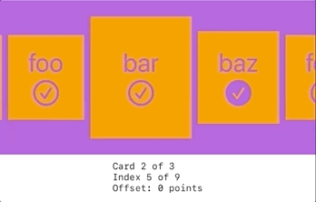

# Loopy Carousel

Submission to the SwiftUI Series **Workarounds** challenge.

# Workaround details

In order to create the illusion of looping through the cards infinitely, we create 2 additional copies of the original deck and we tape them toghether making a 3x length tape.

Before transitioning to the card tapped by the user we reposition the strip using a calculated offset so that we are always set around the middle of the strip.

We do this explicitely without any animation and the goal is for the user not to notice any visual changes whatsoever.

Finally we animate in the direction of the target card by moving the offset one more time, this time using `withAnimation()`.
